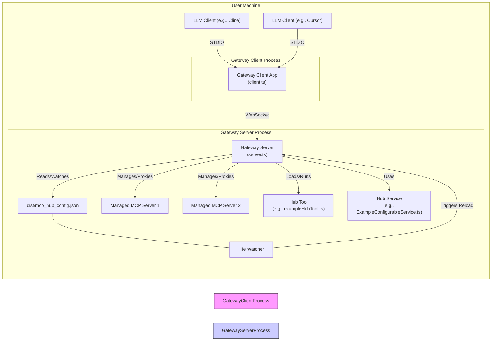

# MCP Server Hub / Gateway

**Purpose:** This project provides a central gateway to manage multiple MCP (Model Context Protocol) servers and expose hub-native tools, preventing the need to configure and run duplicate server processes for each LLM client (like Cline, Cursor, etc.). It supports **dynamic configuration reloading**, allowing managed servers and hub tools/services to be updated without restarting the main gateway server. Connect your LLM client to the single `gateway-client` endpoint provided by this project to access tools from all your managed MCP servers and the hub itself through one interface.

## Architecture

The system consists of two main components within this repository:

1. **Gateway Server (`src/server.ts`):**
    * The core hub process that runs persistently.
    * Reads an initial configuration file (`mcp_hub_config.json`) during startup. **Crucially, the build process copies this file to the `dist/` directory, and the running server watches the `dist/mcp_hub_config.json` file for changes.**
    * **Dynamically manages** the lifecycle (start, stop, monitor, restart) of underlying MCP servers defined in the `mcpServers` config section.
    * **Dynamically loads/unloads/updates** hub-native tools defined in the `hubTools` config section.
    * Supports **configurable internal services** (like `exampleService`) that react to config changes.
    * Listens for WebSocket connections from Gateway Clients (default port 8081).
    * Discovers tools from managed servers and exposes them with a `serverId__toolName` namespace.
    * Exposes hub-native tools with a `hub__toolName` namespace.
    * Routes tool calls received from Gateway Clients to the appropriate managed server or internal hub tool handler.

2. **Gateway Client (`src/client/client.ts`):**
    * Acts as the proxy server that LLM clients connect to via STDIO.
    * Connects to the running Gateway Server via WebSocket (with auto-reconnect).
    * Forwards MCP requests (like `mcp_listTools`, `mcp_callTool`) from the LLM Client to the Gateway Server.
    * Returns responses from the Gateway Server back to the LLM Client.
    * **Periodically polls** the Gateway Server for tool list updates to handle dynamic changes (configurable via `CLIENT_TOOL_REFRESH_INTERVAL_MS` env var, defaults to 5 minutes). (Does not work in Claude Desktop)
    * Restart the MCP client process to refresh the tool list.

**Workflow Diagram:**



## Getting Started

### 1. Prerequisites

* Node.js (v20+ recommended)
* npm
* The underlying MCP servers you want to manage must be installed/accessible.

### 2. Installation & Build

```bash
# Clone the repository (if you haven't already)
# git clone ...
# cd mcp-server-hub-server

# Install dependencies
npm install

# Build the Gateway Server and Client code
# This compiles TypeScript AND copies mcp_hub_config.json to dist/
npm run build
```

### 3. Configuration (`mcp_hub_config.json`)

Configure the hub by editing the `mcp_hub_config.json` file in the **project root directory**. The `npm run build` command will copy this file into the `dist/` directory. The running server watches the file inside `dist/` for live changes.

**Example `mcp_hub_config.json`:**

```json
{
  "mcpServers": {
    "thought-server": {
      "command": "node",
      "args": ["D:\\Projects\\mcp-thought-server\\build\\index.js"],
      "env": {},
      "autoRestart": true
    },
    "file-ops": {
      "command": "node",
      "args": ["D:/Projects/mcp-servers/Cline/MCP/file-operations-server/build/index.js"]
    }
    // Add entries for other managed MCP servers here...
  },
  "hubTools": {
    "example": {
      "description": "An example tool provided by the hub itself.",
      "modulePath": "./exampleHubTool.js", // Path relative to dist/tools/
      "handlerExport": "default", // Optional, defaults to 'default'
      "enabled": true // Optional, defaults to true
    }
    // Add entries for other hub-native tools here...
  },
  "exampleService": {
    "featureFlag": false,
    "messagePrefix": "INITIAL"
    // Add other settings specific to ExampleConfigurableService
  },
  "settings": {
    "logLevel": "info", // Optional: 'error', 'warn', 'info', 'debug'
    "wsPort": 8081,     // Port for Gateway Clients (WebSocket)
    "ssePort": null     // SSE interface port (null to disable)
  }
}
```

**Key Configuration Sections:**

* `mcpServers`: Defines external MCP servers managed by the hub.
  * Key: A unique `serverId` (used for tool namespacing, e.g., `thought-server`).
  * `command`, `args`, `env`, `workingDir`, `autoRestart`, `maxRestarts`: Standard process configuration.
* `hubTools`: Defines tools implemented directly within this hub project (in `src/tools/`).
  * Key: The base name for the tool (e.g., `example`).
  * `description`: Tool description.
  * `modulePath`: Path to the compiled JS file (relative to `dist/tools/`).
  * `handlerExport` (Optional): Named export containing the tool handler function (defaults to `default`). The module should also export an `inputSchema` (Zod schema).
  * `enabled` (Optional): `true` or `false` (default: `true`).
* `exampleService`: Configuration specific to the `ExampleConfigurableService`. Add sections here for other configurable hub services.
* `settings`: General gateway settings.
  * `wsPort`: Port for the WebSocket interface used by the `gateway-client`.
  * `logLevel`: Logging verbosity.
  * `ssePort`: Port for the Server-Sent Events interface (if enabled).

**Dynamic Reloading:** Changes saved to `dist/mcp_hub_config.json` while the server is running will be automatically detected and applied.

* Changes in `mcpServers` will cause the corresponding server process to be stopped/started/restarted.
* Changes in `hubTools` will load/unload/reload the specified tool modules.
* Changes in `settings` or service-specific sections (like `exampleService`) will trigger events that relevant components listen for.

### 4. Running the Gateway Server

Open a terminal in the project root directory (`mcp-server-hub-server`) and run:

```bash
# Ensure you have built the project first!
npm run build

# Start the server
npm start
```

This reads `dist/mcp_hub_config.json`, starts managed servers, loads hub tools, starts the WebSocket listener, watches the config file, and keeps running until manually stopped (Ctrl+C).

### 5. Configuring Your LLM Client (e.g., Cline)

Your LLM client only needs **one** MCP server configured: the `gateway-client`.

Add the following entry to your client's MCP server settings file (e.g., Cline's `cline_mcp_settings.json`), **making sure to use the correct absolute path to this project**:

```json
{
  "mcpServers": {
    // Remove configurations for individual servers like thought-server, file-operations, etc.
    "gateway-client": {
      "command": "node",
      "args": [
        // Use the FULL, absolute path to the compiled client script
        "d:/Projects/mcp-server-hub-server/dist/client/client.js"
      ],
      "options": {
        // CWD should be the project root
        "cwd": "d:/Projects/mcp-server-hub-server"
      },
      "env": {
        // Optional: Configure client polling interval (default is 5 minutes)
        // "CLIENT_TOOL_REFRESH_INTERVAL_MS": "60000" // e.g., 60 seconds
      },
      "disabled": false,
      "autoApprove": []
    }
    // Only the gateway-client entry is needed here
  }
}
```

When the LLM client connects to `gateway-client`, it will automatically start the client process (`node dist/client/client.js`), which then connects to the already running Gateway Server via WebSocket.

### 6. Using Tools

Once the Gateway Server is running and your LLM Client is connected to the `gateway-client`:

* List tools in your LLM Client. You should see namespaced tool names:
  * Managed server tools: `serverId__toolName` (e.g., `thought-server__integratedThinking`)
  * Hub-native tools: `hub__toolName` (e.g., `hub__example`)
* Call tools using these full, namespaced names.
* **Note:** Due to dynamic configuration, the tool list might change over time. The `gateway-client` polls for updates periodically (default 5 minutes, configurable via `CLIENT_TOOL_REFRESH_INTERVAL_MS` env var for the client process). There might be a short delay between a server-side change and the client becoming aware of it. See `docs/client-dynamic-tools-guide.md` for details.

## Troubleshooting

* **ENOENT Error Starting `gateway-client` in LLM Client:** Ensure the `command` (`node`), `args` (absolute path to `dist/client/client.js`), and `options.cwd` (absolute path to project root) in the LLM Client's MCP settings are correct for your system.
* **Tool Name Validation Error (`String should match pattern...`):** Ensure your `serverId` keys and `hubTools` keys in `mcp_hub_config.json` only contain `a-zA-Z0-9_-`.
* **Gateway Client Cannot Connect to Server:** Verify the Gateway Server (`npm start`) is running. Check the `wsPort` in `dist/mcp_hub_config.json` matches the URL used by the client (default `ws://localhost:8081`). Check firewalls.
* **Initial `listTools` Fails/Times Out in LLM Client:** This can happen if the LLM client sends the request before the `gateway-client` process fully connects to the Gateway Server's WebSocket. The client queues the request, and subsequent calls should work. Check the Gateway Client logs for queueing messages (you might need to run `node dist/client/client.js` manually in a separate terminal to see its logs).
* **Managed Server Errors (`[serverId/ERR]`):** Errors logged with a specific server ID prefix indicate problems within that underlying managed server, not the Gateway itself. Troubleshoot that server directly.
* **Dynamic Config Not Reloading:** Ensure you are modifying `dist/mcp_hub_config.json` while the server is running. Check the Gateway Server logs for file watcher messages and potential validation errors upon reload. Ensure the build process successfully copied your intended config from the root to `dist/`.

## Development

* **Run Dev Server:** `npm run dev` (uses nodemon for auto-restart of the Gateway Server on `src` changes). Note: This does *not* automatically rebuild/copy the config or restart the client/managed servers. You'll need to run `npm run build` and restart manually for config/client changes.
* **Linting/Formatting:** `npm run lint`, `npm run format` (also run via pre-commit hook).
* **Testing:** `npm test` (currently limited, see `tests/`).
